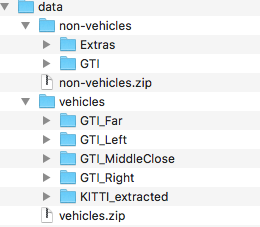

# Vehicle Detection

Goal
---
The goal of this project is to write a software pipeline to detect vehicles in a video.

Requirements
---
 - CarND Starter Kit
 - OpenCV
 - scikit-learn
 - Training Data

Here are links to the labeled data for [vehicle](https://s3.amazonaws.com/udacity-sdc/Vehicle_Tracking/vehicles.zip) and [non-vehicle](https://s3.amazonaws.com/udacity-sdc/Vehicle_Tracking/non-vehicles.zip) examples to train your classifier.  These example images come from a combination of the [GTI vehicle image database](http://www.gti.ssr.upm.es/data/Vehicle_database.html), the [KITTI vision benchmark suite](http://www.cvlibs.net/datasets/kitti/), and examples extracted from the project video itself.

**Location of training Data**

The code expects to find the unzip training data in a directory called `data`

**Write Up**

[The writeup for this project can be found here](./writeup.md)

**Video Link**
[The Final processed video can be found here](https://drive.google.com/open?id=0BwiJ5381w9ktOHlKN2k2ekVqcUE)
