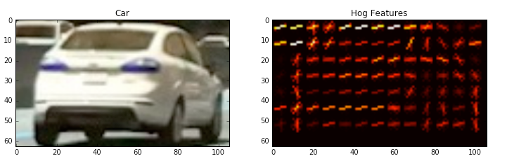
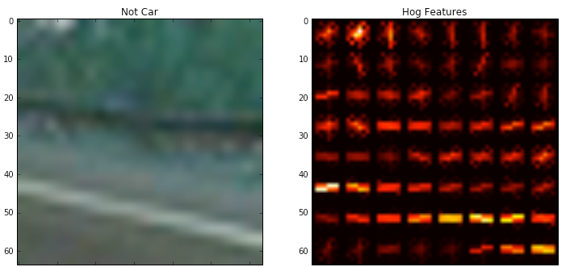
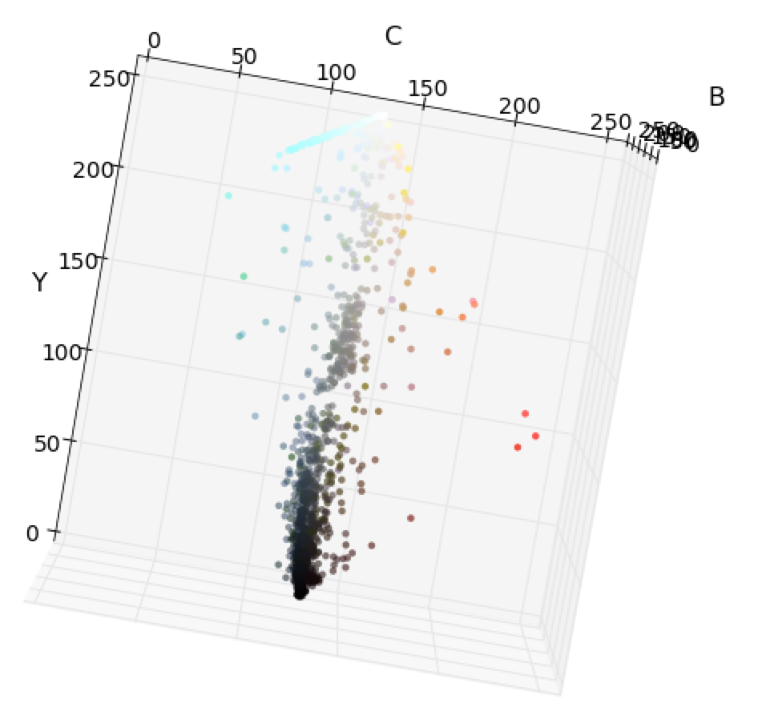
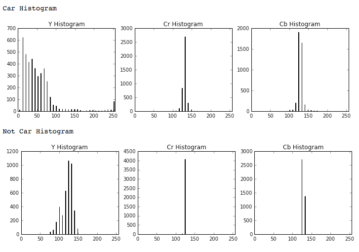
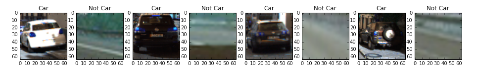
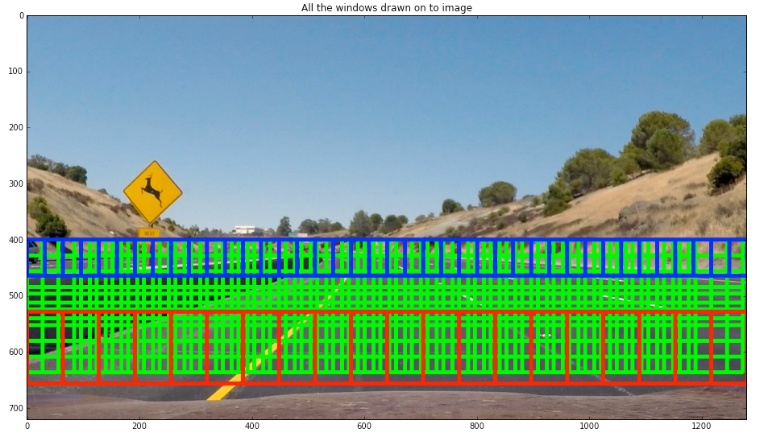
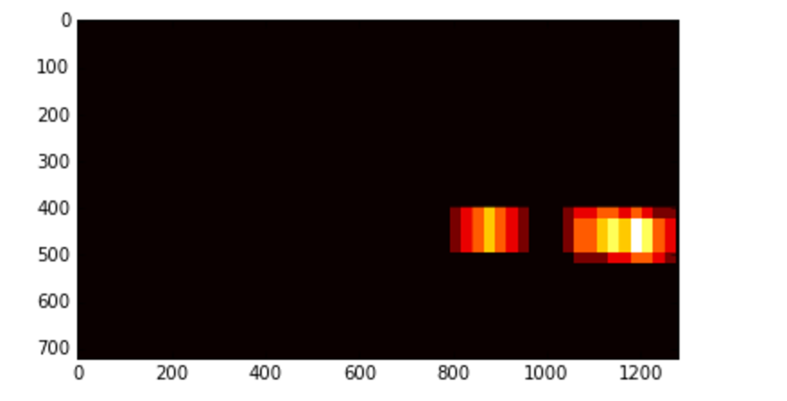
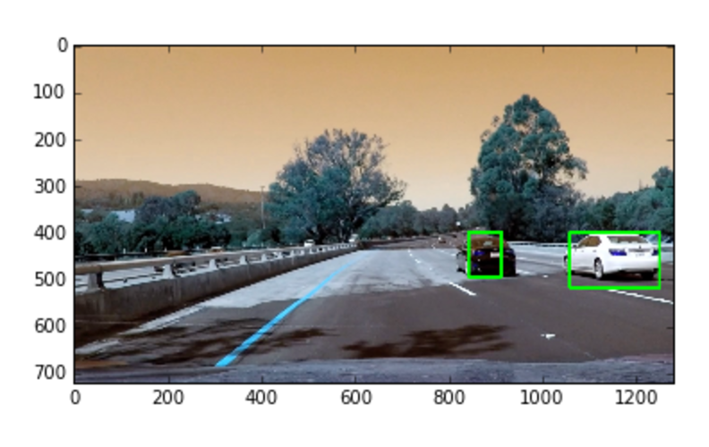

# **Vehicle Detection And Tracking**

## Goals
- Detect vehicles on a road from a video Stream

## Steps
1. Train a machine learning classifier which can differentiate between car and non car images
2. Using sliding window search detect locations of a car in an images

## Training

### Extraction of features:

**HOG features**

Histogram of Oriented Gradients(HOG) are used to get features which depend on shape of an object. The input image is divided into a number of small cells and the Histogram of gradients divided into 9 bins (number of orientations) is calculated.
The max value of this Histogram gives us the dominant gradient direction in the particular cell. This is useful in detecting edges and achieving color invariance. Doing this for the whole image gives us its HOG features. At first only HOG features were used to train the classifier which gave a high accuracy of 99.8 % but when running the classifier on video it didn't perform well in classifying cars with bright colors. After some experimentation using HOG features from all the color channels provided best results along with using Histogram and spatial binning of color. The `skimage.features.hog` function was used at first but it was very slow (10 times) compared to `cv2.HOGDescriptor()`. While I at first experimented with `skimage` implementation but doing it proved to be very time consuming. The `cv2.HOGDescriptor` only gives back the feature vector, therefore the images below are taken from `skimage.features.hog` but while training and testing the classifier the end result of both the implementations is more or less same with `cv2.HOGDescriptor` giving lesser number of false positives while being significantly faster.

The parameters used to extract HOG features are as follows:
1. 8 pixels per cell
2. 2 Cells per block
3. 9 Orientation bins

These parameters were settled upon by experimentation. Also in the documentation for `cv2.HOGDescriptor()` it says that only these parameters are allowed. I experimented with increasing pixels per cells which improved speed but with increased number of false positives.  

**Examples of Hog Features**

As can be seen the HOG features correctly identify shape information of an image. HOG can hence be used to classify shapes easily.

**Spatial binning of Color**

Raw pixel values can also be helpful in classification of images. While used on their own they don't provide much information about the object to be classified but when used along with HOG features they improved the accuracy of the classifier. The feature vector for raw pixel value was computed by first resizing the image to 32x32 pixels and then extracting the color information by using `numpy.ravel()`

**Example**

**Color Histogram**

Histogram of each color channel of YCrCb space divided into 64 bins are calculated
and then calculated. Histograms of car images and non car images are able to distinguish between car and non car images as the road has mostly pale and dark colors while cars usually have a single prominent color. For example a blue colored car is mostly blue while the road usually is dark colored. This scheme however doesn't not completely  achieve color invariance. So these features are used along with HOG features.

**Example**

**Final**

Various combinations of features and various color spaces were used to find the best feature vector to train the final classifier. At first I used HSV color space but in that the classifier had problems classifying cars with white color even though the test set accuracy was high (~98%). On using only the HOG features on all channels and YCrCb color space, the test accuracy increased to ~99.6 % but it didn't identify bright cars well. Finally I settled on using HOG on all three color channels of YCrCb and spatial binning and color histogram. The final length of the feature vector was 8556. The effect of individual spatial binning, HOG, and histogram features gets equalised because of the use of StandardScaler.  

### Training Data

**Analysis**

The training data used to train the SVM had xxx vehicle and xxx non-vehicle images.  These are taken from KITTI and GTI vehicle image databases. The GTI images contain images of the same vehicle taken from different angels and distances while as the images from KITTI just contain random images of cars. The GTI have been taken out of a video stream and hence there are a lot of images of the same car.

**Examples of training Data**

**Preprocessing**

To extract features from the car the training images are read with `cv2.imread()` function which gives back pixel values in range of 0-255. After the features are extracted from the images, they are standardized to have zero mean and unit variance using `sklearn.preprocessing.StandardScaler`. The computed Scaler is saved for later use to scale the image feature data while using the classifier.

## Searching for cars within video stream

#### Sliding Window search

To search for cars in the individual frames of the video a sliding window search was conducted within the region of the image the cars were most likely to be found.
The search area was restricted to y = 400 to y = 656. Three window sizes were used: 64x64 and 96x96 and 128x128. Cutouts from each window positions were taken from the frame, resized to 64x64 and features were extracted and then scaled and then passed on to the classifier.

**Example**

 - Red : 128x128 with overlap of 0.5. *The closer the car to the camera, bigger the size in the image*
 - Green : 96x96 with overlap of 0.7. *This was used everywhere. A denser grid was chosen here to increase number of Multiple detections so that there can be a higher thresholding to remove false positives*
 - Blue : 64x64 with overlap of 0.5. *The smaller windows were used in the top fraction of the search area*

#### Removing Multiple Detections and False Positives with Heat maps

To remove false positives, heat maps were generated for 12 consecutive frames(>2), and then the bounding boxes were drawn. For each positive match in the classifier, 1 heat was added to the region of that hit. To calculate position of the bounding boxes, the heats of at most 12 previous frames were added together. This has the effect of removing jitter from the bounding boxes which are drawn. By thresholding the heat map along with heat maps of some previous frames, any false positives also get removed.

**Example of Heat Map and final image**

## Possible Improvements
1. A Deep learning approach can be used instead (YOLO or SSD).
2. The pipeline could be speeded up greatly if many operations like classifying multiple windows is done in parallel.
3. Time series dependence of the training data can be removed to make the classifier generalize better.
4. HOG of the whole search area of the image can be taken at once instead of taking HOG of individual cells. I couldn't find the proper python documentation for `HOGDescriptor()` which returns the feature vector directly so I couldn't implement it.  

### References

1. Many functions are copied from Udacity Classroom
2. StackOverflow
3. Udacity Forums
